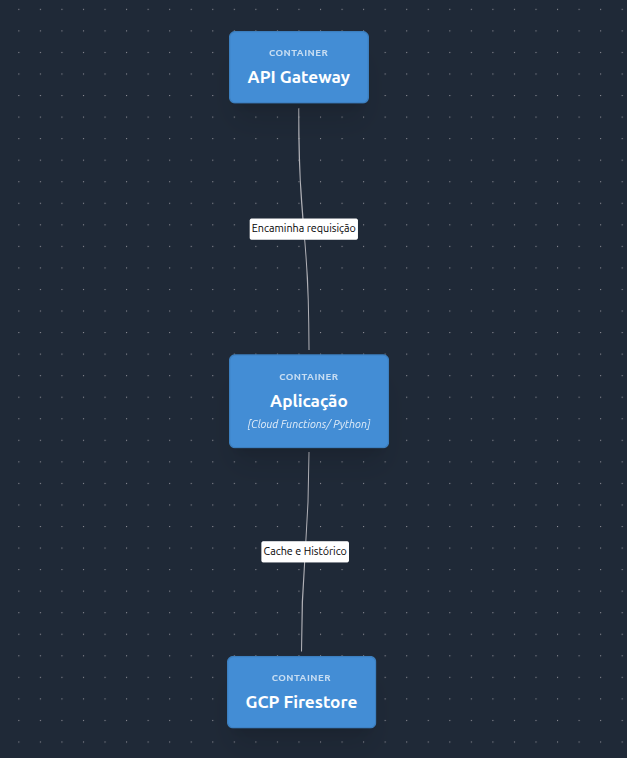
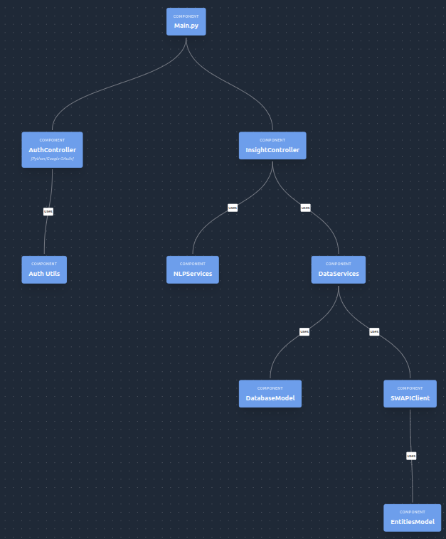

# Arquitetura de Software (C4 Model)

Esta seção detalha a estrutura técnica da **Star Wars Insights API**, utilizando a metodologia **C4 Model** para fornecer uma visão clara desde o contexto de negócio até os componentes internos de execução.

## Diagrama Interativo

O diagrama abaixo é multinível. Ele permite visualizar a orquestração entre os serviços do **GCP (Cloud Functions, Firestore e API Gateway)** e a integração com provedores externos como **Google Auth** e **SWAPI**.

<a href="./html_extras/arch.html" target="_blank">Abrir o Diagrama em uma nova aba</a>

<iframe src="./html_extras/arch.html" style="width: 100%; height: 700px; border: 2px solid #f0f0f0; border-radius: 8px;"></iframe>

### Manual de Navegação
* **Visualização de Detalhes:** Clique em um **Nó (Node)** para expandir sua descrição técnica e tecnologias envolvidas.
* **Navegação de Nível:** Caso o componente possua subníveis (como o `Star Wars Insights Platform`), clique para entrar no contexto de containers e componentes.
* **Relacionamentos:** As setas indicam o fluxo de dados entre os nós.

---
## Visão Geral

<h3>Atores e Sistemas Externos:</h3>

- **Usuário / Client:** O ponto de partida. Pode ser o seu Playground em GitHub Pages ou qualquer cliente enviando tokens via header.

- **Google Auth Service:** Sistema externo que emite e valida a identidade do usuário via OAuth2.

- **SWAPI External:** É a API pública de Star Wars que fornece os dados crus.

<h2>Infraestrutura (GCP Context)</h2>

- **Star Wars Insights Platform:** O limite do seu sistema, englobando tudo que você controla no GCP.

- **API Gateway:** A casca de proteção e roteamento. Gerencia CORS e autenticação.

- **Aplicação / Cloud Function:** O ambiente serverless onde seu código Python escala sob demanda.

- **GCP Firestore:** Banco de dados NoSQL usado para persistir o histórico de buscas dos usuários e o cache de entidades hidratadas.

<h2>Componentes Internos (Software Design)</h2>

- **Main.py**:O entrypoint da função. Faz o roteamento interno (handshake) das URLs para os controladores.

- **InsightController:** O "cérebro". Coordena a lógica entre a entrada do usuário, o processamento de texto e a busca de dados.

- **AuthController:** Gerencia especificamente o fluxo de login e verificação de perfil.

- **Auth Utils:** Ferramentas de baixo nível para troca de tokens e geração de URLs de autenticação.

- **DatabaseModel**: Abstração que facilita operações de CRUD no Firestore.

- **SWAPIClient:** Cliente HTTP otimizado para se comunicar com a API externa.

- **EntitiesModel:** Definições de classes Pydantic (Planetas, Naves, etc.) para garantir integridade dos dados.

- **NLPServices:** Camada de inteligência que traduz "Quem é o Luke?" em filtros que o sistema entende.

- **DataServices:** Camada responsável pela "Hidratação" (transformar URLs da SWAPI em nomes legíveis) e manipulação de dados em paralelo.

## Decisões de Arquitetura

A escolha dessa estrutura foi pautada em três pilares fundamentais:

1.  **Escalabilidade Serverless:** A arquitetura baseada em **Cloud Functions** garante que a API suporte picos de tráfego sem a necessidade de gerenciamento de infraestrutura. Em conjunto com o API Gateway, ela oferece escalabilidade e flexibilidade para atender aos requisitos de escala da API.
2.  **Resiliência com Cache-Aside:** O uso do **Firestore** como camada de persistência e cache garante que a aplicação continue funcional e rápida mesmo em momentos de instabilidade na API de origem (SWAPI).
3.  **Autenticação e Autorização:** O uso de **Google Auth** garantem a autenticação e autorização de usuários, permitindo o acesso aos recursos da API.